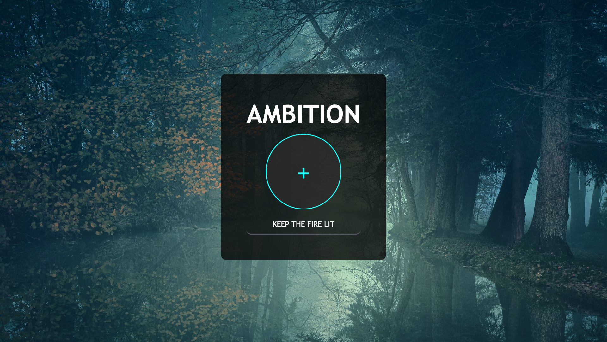
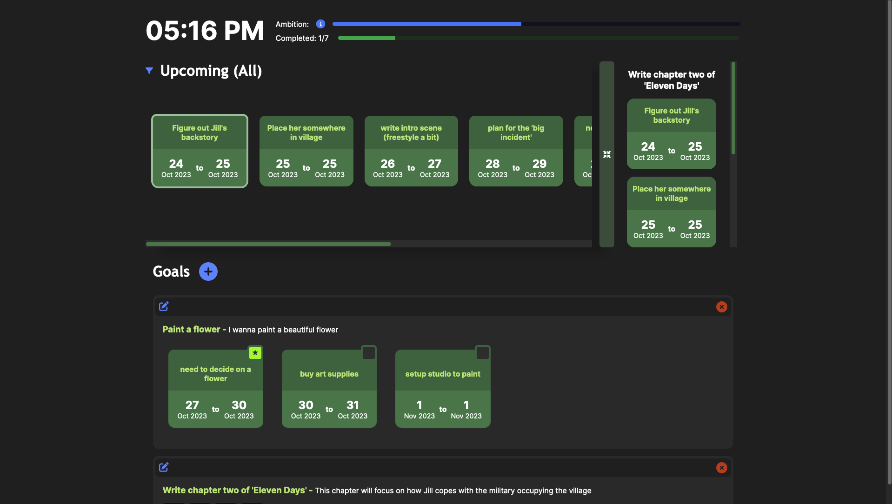
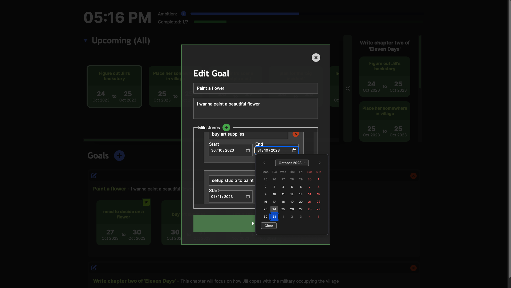

# AMBITION 
This is a goal tracker that replaces your 'new tab' page on Firefox

## FEATURES
- create, read, update, delete capabilities for both goals and milestones
- ambition bar that ticks down every second (can be fed by completing milestones)
- dynamic Upcoming section that can be filtered to within seven days
- persisting data via local storage
- collapsible goal preview section

## HOW DO I GET THIS UP AND RUNNING ?
- run npm install
- run npm start dev

## SCREENSHOTS

### Initial Screen

### Homepage

### Editing Goal

